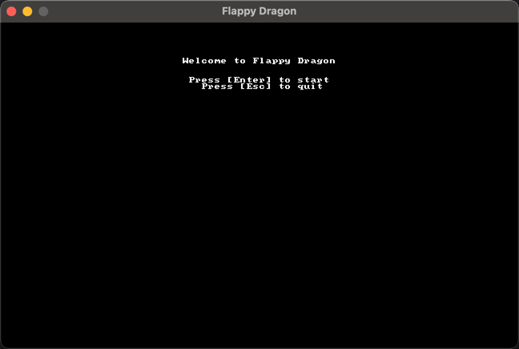
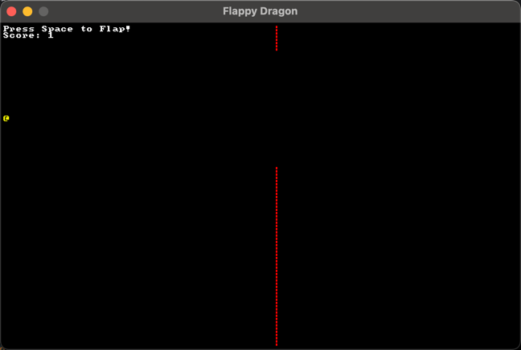
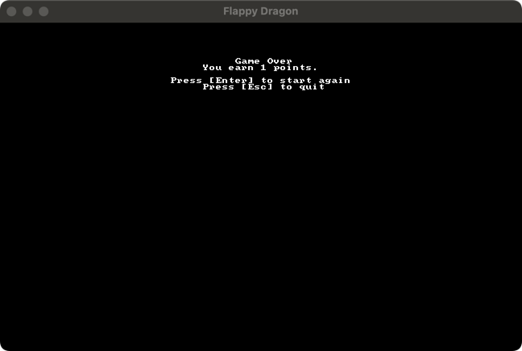

# Flappy Dragon

这是一个基于 [bracket-lib](https://crates.io/crates/bracket-lib) 编写的 Flappy Bird 风格小游戏示例，使用 Rust 语言进行开发。

## 功能介绍

- **主菜单**：游戏启动时展示主菜单，可选择开始游戏或退出；
- **游戏过程**：玩家控制一条“飞龙”上下移动，需避开竖直的障碍物；
- **计分系统**：每当玩家成功通过障碍物时，得分加 1；
- **游戏结束**：若玩家撞到障碍物或飞出屏幕，游戏结束并显示得分与重试选项。

## 操作说明

- **开始游戏**：在主菜单界面按下 <kbd>Enter</kbd> 键；
- **退出游戏**：在主菜单或游戏结束界面按下 <kbd>Esc</kbd> 键；
- **控制飞龙**：在游戏中按下 <kbd>Space</kbd> 键，让飞龙向上飞（即“扇动”），否则飞龙会逐渐下降；
- **重新开始**：游戏结束后按下 <kbd>Enter</kbd> 键重新开始。

## 游戏截图

1. Menu 
   

2. Playing
   

3. Game Over
   

## 依赖

- Rust 编译环境（建议版本 `1.60+` 或更高）
- bracket-lib（已在 `Cargo.toml` 中配置）

## 编译与运行

1. 安装 [Rust](https://www.rust-lang.org/)。若已安装则可跳过此步骤。
2. 在项目根目录下执行以下命令进行编译并同时运行游戏：
   ```bash
   cargo run
   ```
3. 若想只编译不运行，可执行：
   ```bash
   cargo build --release
   ```
   随后可在 `target/release` 目录下找到可执行文件，并直接运行。

## 项目结构

- **main 函数**：游戏的入口，初始化 Bracket Terminal，并启动主循环 `main_loop`；
- **State**：游戏的核心状态结构，包含玩家状态、分数、关卡信息、游戏模式（菜单、游戏中、游戏结束）等；
- **Player**：玩家“飞龙”的属性及方法（位置、速度、渲染、重力与移动等）；
- **Obstacle**：障碍物的属性及方法（位置、缺口位置、缺口大小、渲染、碰撞检测等）；
- **GameMode**：游戏模式的枚举类型（菜单、游戏中、游戏结束）。

## Reference

- [使用 Rust 开发一个微型游戏](https://www.bilibili.com/video/BV1vM411J74S?spm_id_from=333.788.videopod.episodes&vd_source=08f6061352a48592300531e0cfa0e49b)
- [flappy_Game](https://github.com/dweb-channel/flappy_Game/tree/main)